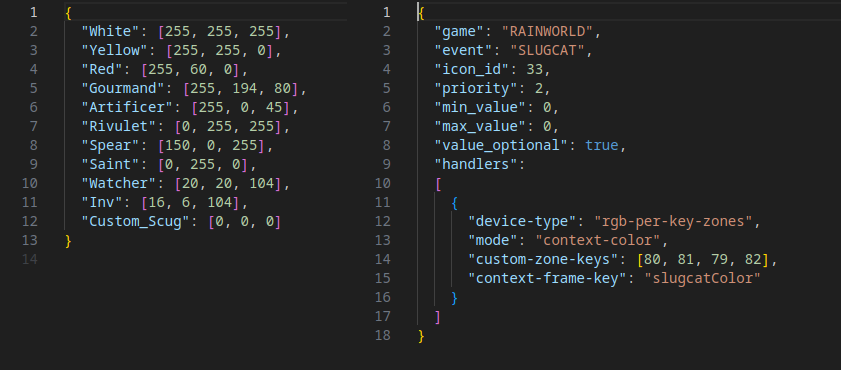

# GameSense Integration For Rain World
**A BepInEx mod that integrates Rain World with the SteelSeries GameSense API, providing live in-game stats on your SteelSeries keyboard.**

## Compatible Keyboards
Any steelseries keyboard with per-key RGB lighting is compatible. This includes all Apex 5, Apex 7, Apex 9, Apex Pro lineups for full sized, tkl, and 60% keyboards.

## An Example Of The Keyboard In Game

# Default Data Setup
- `Rain Timer` - F keys
- `Breath` - Navigation keys
- `Karma` - Number keys 1-0
- `Food` - All Keys between tab and backslash
- `Temperature` - Keys A-J
- `Karma Protected` - Tilde key
- `Region` - All keys bordering the keyboard + numpad
- `Slug Cat Color` - Arrow keys
- `Stunned` - Arrow Keys (Effect triggered when character is stunned)
- `Dead` - Arrow Keys (Effect triggered when character dies)
- `Muddy` - Arrow Keys (Effect triggered when character is muddy)

(The location and behavior of each statistic can be configured in the apps menu of the Steelseries Engine)

# Getting Started
This mod is designed to be as plug-and-play as possible. If you just want to download and use it, you can find a fully packaged release in the **Steam Workshop**.
**SteelSeries Engine** should also be installed, and the mod should be enabled in Rain World's remix settings (the mod will automatically detect where SteelSeries is listening through its `coreProps.json` file and start communicating from there). It is also recomended that your current keyboard profile has all of it's keys set to rgb(0,0,0) in the engine to get the full visual experience.

## If You Have A Custom Steelseries Installation
This situation needs special attention, as the mod will only look for the `coreprops.json` file in `C:\ProgramData\SteelSeries\SteelSeries Engine 3` (The `coreprops.json` file is necessary for discovering what port Steelseries is listening on so that the mod can communicate with it). If you have a custom installation, go to wherever your `coreprops.json` file is located, copy the address in the `address:` field (example: 127.0.0.1:54136), then paste it into the `address:` field in this mod's `steelseries-address.json` file located at `/Rain World/RainWorld_Data/StreamingAssets/mods/rwgamesense/config/steelseries-address.json`. (This mod will always check the `steelseries-address.json` file on startup, so if it's not empty, that address will be used by the mod.)

If you're having trouble getting the mod to work, check the `debug.log` file located at `/Rain World/RainWorld_Data/StreamingAssets/mods/rwgamesense/debug.log`

# Mod Configuration
There are two different ways that this mod can be configured 
- **Through The Steelseries App** - Controls where and how the lighting is displayed on the keyboard.
- **Through Json files in the mod's config folder: `/Rain World/RainWorld_Data/StreamingAssets/mods/rwgamesense/config`** - More advanced configuration like the exact payload instructions, and RGB arrays used by the mod.

## Using The Engine To Configure Stats

(Any bind-event json file will be overruled by any existing event configurations in the steelseries app.)

## Using Jsons To Configure Stats

# Future Aspirations
This project is currently in **Beta**, as I’m gauging community interest. If the mod gains some traction, here are a few planned features:

- **Remix Menu Configuration:** Integrate configuration directly into the Remix Menu rather than relying solely on JSON files in the mod’s directory.
- **Additional Stats:** Fetch more data points, such as Slug Pup Hunger and Player Speed.
- **Universal Keyboard Support:** This suggestion should be taken lightly, as I haven’t yet found a viable alternative to SteelSeries GameSense that supports a wide range of RGB keyboards.

# Known Issues
- **Problem With Multiplayer Compatibility:** Due to how player stats are currently retrieved (`Players.FirstRealizedPlayer`), game instances with multiple players (such as **Meadow** or **Jolly Co-op**) may cause some errors with gathering data. I’m currently working on a better way of pulling stats.

<!--
# For Developers

## File Higherarchy

## Classes Overview

## Debugging>
-->

